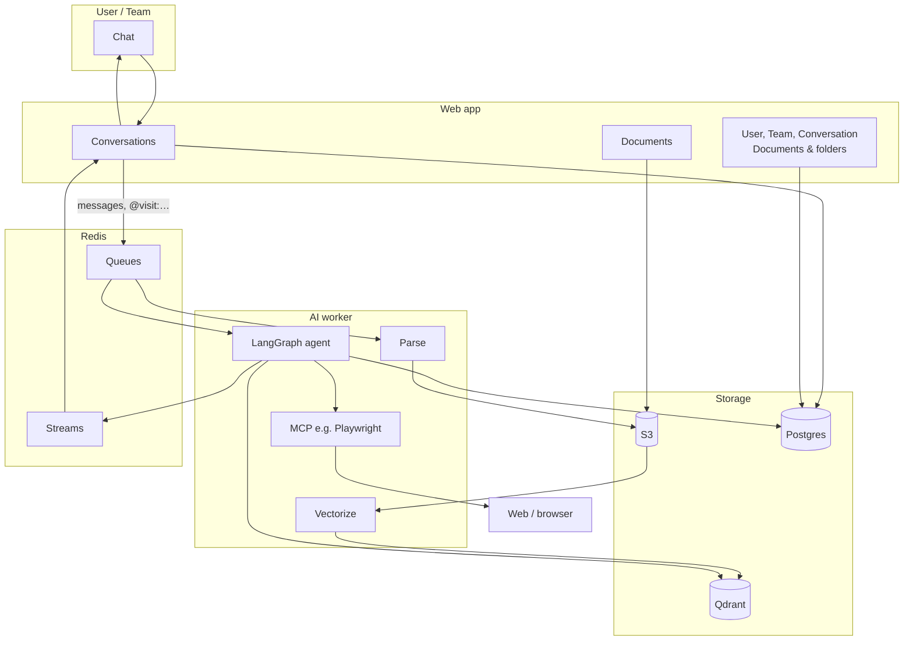

# Omni Agent

A full-stack platform for **RAG and conversational AI**: ingest documents into vector search, then chat with an agent that can use your data and act on commands (e.g. visit a URL via MCP). The **web app** is the interface and source of identity and context; the **AI worker** runs document pipelines and the LangGraph agent.

---

## Goals

- **Document ingestion** — Upload files; parse (with routing by type/complexity) and vectorize into Qdrant. Parsed output is cached in S3 so vectorize can be retried or re-run for another collection without re-parsing.
- **Conversations** — Users and teams have conversations with a LangGraph agent running in the AI worker. The web app sends messages (including special tags like `@visit:wp.pl`) and receives streamed replies via Redis Streams.
- **IAM & context** — User → Team → Conversation; documents and folders are scoped to a user or team. The agent gets RAG context only from the documents/folders the user or their team can access.
- **Agent tools** — Inline commands in chat (e.g. `@visit:url`) are handled by the agent using MCP servers (e.g. Playwright for browsing). Conversation state and LangGraph context live in Postgres (web DB).

---

## Architecture



---

## Repo layout

| App | Purpose |
|-----|--------|
| **web** | Next.js + NestJS. UI, documents (S3), IAM, conversations; consumes Redis Streams for agent replies. |
| **ai-worker** | Celery + Python. Parse and vectorize pipelines; LangGraph agent with RAG and MCP; produces Redis Streams. |

```
omni-agent/
├── apps/web/          # Next.js + NestJS
├── apps/ai-worker/    # Celery + Llama Index + (planned) LangGraph
├── justfile           # just run, just web <cmd>, just ai <cmd>
└── README.md
```

---

## Tech stack

- **Web** — Next.js 16, React 19, NestJS, Tailwind 4, Radix UI, Drizzle, Postgres, S3, Redis (Streams).
- **AI worker** — Python 3.11+, Celery, Redis, Llama Index, LlamaParse, Pandas, PyMuPDF, Gemini, Qdrant, S3; (planned) LangGraph, Redis Streams, MCP (e.g. Playwright).
- **Monorepo** — pnpm (web), uv (ai-worker), just.

---

## Getting started

**Prerequisites:** Node 20+, pnpm, Python 3.11+, uv, Redis, Postgres, Qdrant, S3-compatible storage. Optional: Llama Cloud key (complex docs), Google key (Gemini).

```bash
pnpm install
just web install
just ai install
just run          # web + ai-worker
```

- **Web only:** `just web run`
- **AI worker only:** `just ai run`

Env vars are per app; see each app’s README.

---

## License

MIT (or as specified in the repository).
