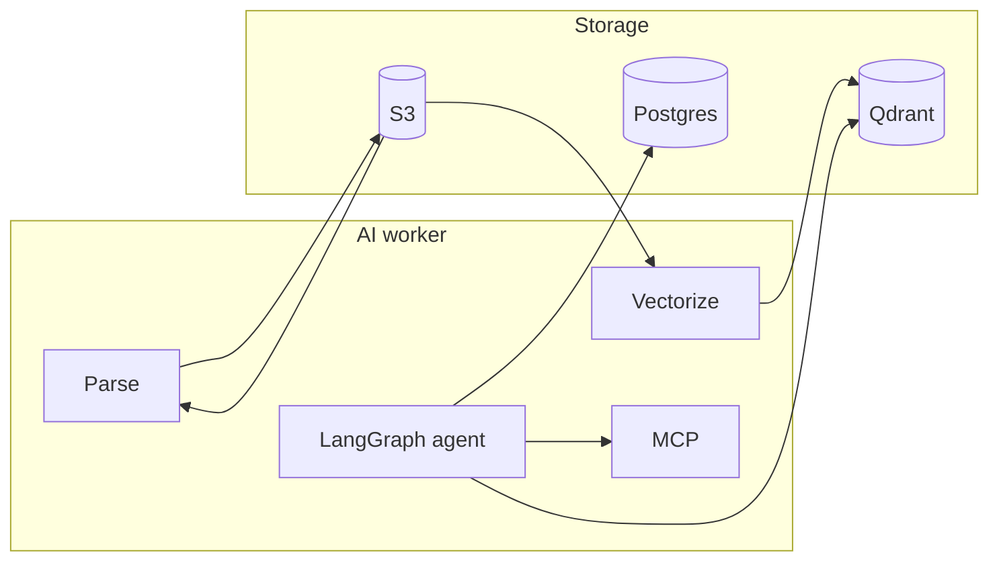

# AI worker

The **document and agent backend** for Omni Agent: a Celery worker that runs the **parse** and **vectorize** pipelines (S3 → parsed S3 → Qdrant) and should host the **LangGraph conversational agent**—RAG over user/team documents, MCP tools (e.g. Playwright for `@visit:…`), and streaming replies to the web app via Redis Streams.

---

## Goals

- **Parse** — Read raw files from S3, route by type and complexity (LlamaParse, Pandas, or local), write parsed JSON to S3, then enqueue vectorize. Two queues so parse and vectorize can be retried independently and parsed output is reused.
- **Vectorize** — Read parsed JSON from S3, split and embed (Llama Index, Gemini), upsert to Qdrant. Collections can be tied to user/team for RAG context.
- **Agent** — LangGraph agent in the worker: consumes conversation requests, uses RAG (Qdrant) and MCP (e.g. Playwright), reads/writes conversation state in Postgres, and streams output to the web via Redis Streams.
- **Commands & MCP** — Inline commands in messages (e.g. `@visit:wp.pl`) are interpreted and executed via MCP servers so the agent can visit pages, snapshot, and more.

---

## Architecture



---

## Tech stack

Python 3.11+, Celery, Redis, Llama Index, LlamaParse, Pandas, PyMuPDF, Gemini, Qdrant, S3, Pydantic Settings. Planned: LangGraph, Redis Streams (stream to web), MCP (e.g. Playwright).

---

## Getting started

**Prerequisites:** Python 3.11+, uv, Redis, Qdrant, S3. Optional: Llama Cloud key (complex docs), Google key (Gemini).

```bash
uv sync
# or: just install
```

Create `.env` with Redis, S3, Qdrant, and (as needed) `LLAMA_CLOUD_KEY`, `GOOGLE_API_KEY`.

```bash
just run
# Celery worker on parse_file + vectorize_file queues
```

---

## Testing

```bash
just test
just test-coverage   # coverage report, 70% minimum
```

---

## Commands

| Command | Description |
|---------|-------------|
| `just run` | Start Celery worker (parse_file, vectorize_file) |
| `just test` | Pytest |
| `just test-coverage` | Pytest with coverage (term + htmlcov) |
| `just install` | uv sync |
| `just add <pkgs>` | Add dependencies (uv add) |

---

## License

MIT (or as specified in the root of the repository).
