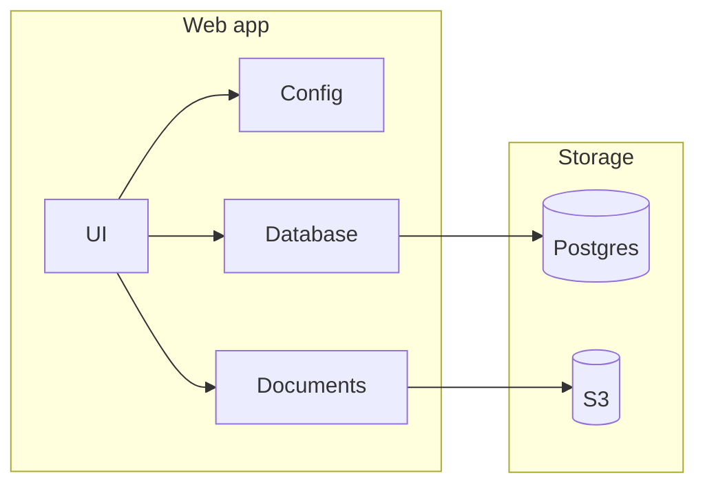

# Web app

The **UI and API layer** for Omni Agent: Next.js 16 (App Router) with NestJS as the backend context. It should provide chat, document management, IAM (user, team, conversation, documents & folders), and conversations with the LangGraph agent—streaming replies from the AI worker via Redis Streams and storing conversation and agent state in Postgres.

---

## Goals

- **Chat** — Users and teams have conversations with the LangGraph agent; messages can include special tags (e.g. `@visit:wp.pl`). The web app sends messages to the worker and shows streamed replies (consuming Redis Streams).
- **Documents** — Upload and download files to/from S3 so the AI worker can parse and vectorize them; same bucket for raw and parsed artifacts.
- **IAM** — User → Team → Conversation; documents and folders scoped to a user or team. The agent’s RAG context is built from the documents/folders the user or their team can access.
- **State** — Postgres holds app data, conversations, messages, and (optionally) LangGraph context so the agent can resume and the web remains the source of truth for who said what.

---

## Architecture



---

## Tech stack

Next.js 16, React 19, NestJS (application context), Tailwind 4, Radix UI, Drizzle, Postgres, S3, pg-boss. Planned: Redis Streams (consume agent stream), Postgres schema for conversations and IAM, chat UI with support for `@…` commands.

---

## Getting started

**Prerequisites:** Node 20+, pnpm, Postgres, S3-compatible storage.

```bash
pnpm install
# From repo root: just web install
```

Create `.env.local` with `DATABASE_URL`, `AWS_REGION`, `AWS_ACCESS_KEY`, `AWS_SECRET_KEY`, `S3_BUCKET_NAME` (and optionally `S3_ENDPOINT` for MinIO).

```bash
pnpm dev
# or: just web run
```

Open [http://localhost:3000](http://localhost:3000).

---

## Commands

| Command | Description |
|---------|-------------|
| `just run` | Next.js dev server |
| `just build` | Production build |
| `just start` | Production server |
| `just lint` | ESLint |
| `just install` | pnpm install |
| `just add <pkgs>` | Add dependencies |

---

## License

MIT (or as specified in the root of the repository).
